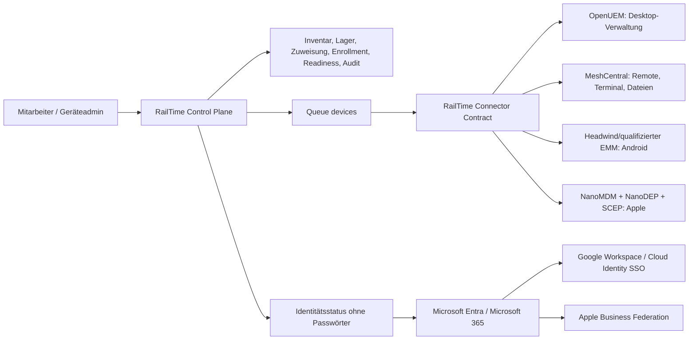

# Zielarchitektur

## Führende Systeme

| Information | Führendes System |
|---|---|
| Mitarbeiter, Teams und fachliche Rechte | RailTime |
| Asset-Nummer, Lager, Ausgabe/Rückgabe, Gerätehistorie | RailTime |
| Technischer Geräte-Istzustand | jeweiliges MDM/UEM/Remote-Backend |
| Microsoft-Identität und Exchange-Lizenz | Entra/Microsoft 365 |
| Google-Identität | Google Workspace/Cloud Identity, bevorzugt aus Entra provisioniert |
| Managed Apple Account/ADE/Apps & Books | Apple Business Manager |
| Freigabe, Grund, Vier-Augen-Prüfung und fachlicher Audit | RailTime |

RailTime spiegelt nur die für die Oberfläche nötigen Zustände. Recovery Keys,
Mailbox-Inhalte, Passwörter, private Schlüssel und vollständige Rohinventare
bleiben im zuständigen Backend.

### Mehrprovider-Zuordnung je Gerät

Ein RailTime-Gerät besitzt nicht nur eine globale technische ID. Die normalisierte
Tabelle `device_provider_links` hält pro Provider genau eine Verknüpfung mit
eigener `external_device_id`, Rolle (`primary` oder `support`), Status sowie
`last_seen_at`/`last_synced_at`. So kann beispielsweise OpenUEM das primäre
Desktop-Management und MeshCentral parallel den Fernsupport übernehmen. Die
alten Felder `devices.primary_provider` und
`devices.primary_provider_device_id` bleiben als rückwärtskompatibler Spiegel
des Primary-Links erhalten; Connector-Aufrufe lesen vorrangig den passenden
Provider-Link. Links enthalten ausdrücklich keine Tokens, Passwörter oder
sonstigen Zugangsdaten.

Eine signierte `enrollment.completed`- oder `device.seen`-Quittung darf eine
optionale, streng validierte `provider_device_id` nur an einen bereits für das
bekannte RailTime-Gerät deklarierten Link binden. Webhooks erzeugen niemals
stillschweigend neue Geräte oder Provider-Verknüpfungen.

Für MeshCentral gilt strenger: Der Connector meldet `enrollment=false`, weil
ein nativer Gruppeninvite weder assignment-/gerätegebunden noch exakt einzeln
widerrufbar ist. Der MeshAgent wird separat vorinstalliert; ein Administrator
prüft die native Node-ID in MeshCentral und bindet sie als aktiven Support-Link
an das bereits inventarisierte RailTime-Gerät. Daraus wird keine automatische
`enrollment.completed`-Quittung abgeleitet. Ohne diesen aktiven Link bleiben
Remote-Support, Diagnose und Skriptausführung geschlossen.

## Connector-Vertrag

Weil die freien Tools sehr unterschiedliche oder teils nicht stabil
dokumentierte Schnittstellen besitzen, sprechen RailTime-Jobs einen engen
Connector-Vertrag:

- `GET /v1/health` – Version, Verbindung, bekannte Fähigkeiten.
- `POST /v1/enrollments` – falls der konkrete Provider diese sichere Fähigkeit
  meldet: kurzlebige, geräte-/mitarbeitergebundene Anleitung. Der
  MeshCentral-Connector lehnt diesen Endpunkt mit `409` ab.
- `POST /v1/commands` – whitelisted Aktion mit Korrelations-ID, RailTime-ID und
  der providerspezifischen externen Geräte-ID; keine freie URL-/Shell-Interpolation.
- `POST /events` zurück an RailTime – HMAC-signiert, zeitbegrenzt und
  idempotent.

Ein Connector darf intern offizielle CLI-, WebSocket- oder REST-Wege des Tools
nutzen. Dadurch bleibt die Laravel-Domäne stabil, wenn ein Backend ausgetauscht
wird. Die UI zeigt ausschließlich die vom Connector gemeldeten Fähigkeiten.

## Sicherheitsmodell

- Provider-Tokens nur in Server-ENV/Secret Store, nie in Livewire-State.
- Separate Lese-, normale Command- und Hochrisiko-Identitäten.
- Zentrale externe-Mutationen-Sperre standardmäßig `false`.
- Lock als eigenes Recht; Wipe nur globaler Admin plus zweiter anderer Admin.
- Einmalige Enrollment-Tokens nur gehasht speichern, atomar einlösen.
- Queue, Retry und Idempotenz je Gerät/Provider; kein Netzwerkkommando im
  Livewire-Request.
- HMAC-Webhook über Zeitstempel plus Rohbody; maximales Zeitfenster fünf
  Minuten.
- Vollständiger fachlicher Audit ohne Secrets oder rohe Kommandopayloads.
