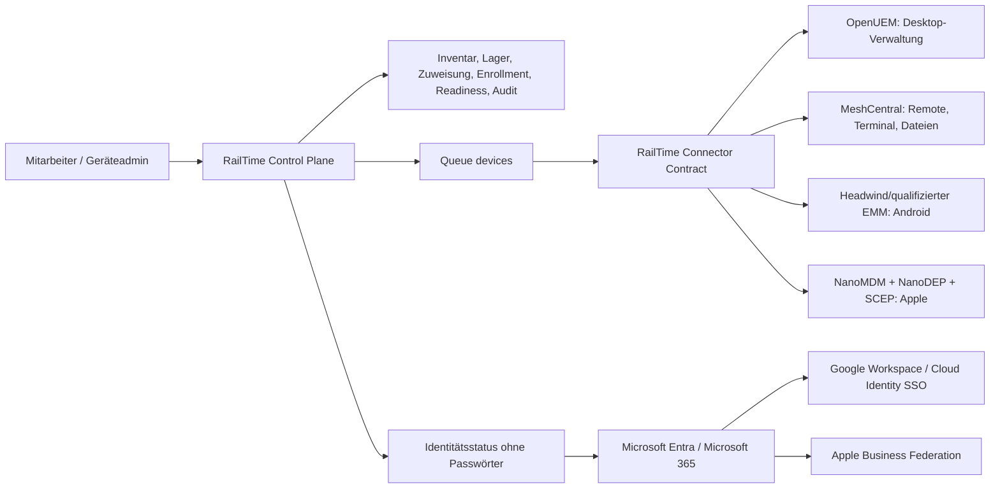

# Zielarchitektur

## Führende Systeme

| Information | Führendes System |
|---|---|
| Mitarbeiter, Teams und fachliche Rechte | RailTime |
| Asset-Nummer, Lager, Ausgabe/Rückgabe, Gerätehistorie | RailTime |
| Technischer Geräte-Istzustand | jeweiliges MDM/UEM/Remote-Backend |
| Microsoft-Identität und Exchange-Lizenz | Entra/Microsoft 365 |
| Google-Identität | Google Workspace/Cloud Identity, bevorzugt aus Entra provisioniert |
| Managed Apple Account/ADE/Apps & Books | Apple Business Manager |
| Freigabe, Grund, Vier-Augen-Prüfung und fachlicher Audit | RailTime |

RailTime spiegelt nur die für die Oberfläche nötigen Zustände. Recovery Keys,
Mailbox-Inhalte, Passwörter, private Schlüssel und vollständige Rohinventare
bleiben im zuständigen Backend.

## Connector-Vertrag

Weil die freien Tools sehr unterschiedliche oder teils nicht stabil
dokumentierte Schnittstellen besitzen, sprechen RailTime-Jobs einen engen
Connector-Vertrag:

- `GET /health` – Version, Verbindung, bekannte Fähigkeiten.
- `POST /enrollments` – kurzlebige, geräte-/mitarbeitergebundene Anleitung.
- `POST /devices/{externalId}/commands` – whitelisted Aktion mit
  Korrelations-ID; keine freie URL-/Shell-Interpolation.
- `POST /events` zurück an RailTime – HMAC-signiert, zeitbegrenzt und
  idempotent.

Ein Connector darf intern offizielle CLI-, WebSocket- oder REST-Wege des Tools
nutzen. Dadurch bleibt die Laravel-Domäne stabil, wenn ein Backend ausgetauscht
wird. Die UI zeigt ausschließlich die vom Connector gemeldeten Fähigkeiten.

## Sicherheitsmodell

- Provider-Tokens nur in Server-ENV/Secret Store, nie in Livewire-State.
- Separate Lese-, normale Command- und Hochrisiko-Identitäten.
- Zentrale externe-Mutationen-Sperre standardmäßig `false`.
- Lock als eigenes Recht; Wipe nur globaler Admin plus zweiter anderer Admin.
- Einmalige Enrollment-Tokens nur gehasht speichern, atomar einlösen.
- Queue, Retry und Idempotenz je Gerät/Provider; kein Netzwerkkommando im
  Livewire-Request.
- HMAC-Webhook über Zeitstempel plus Rohbody; maximales Zeitfenster fünf
  Minuten.
- Vollständiger fachlicher Audit ohne Secrets oder rohe Kommandopayloads.

