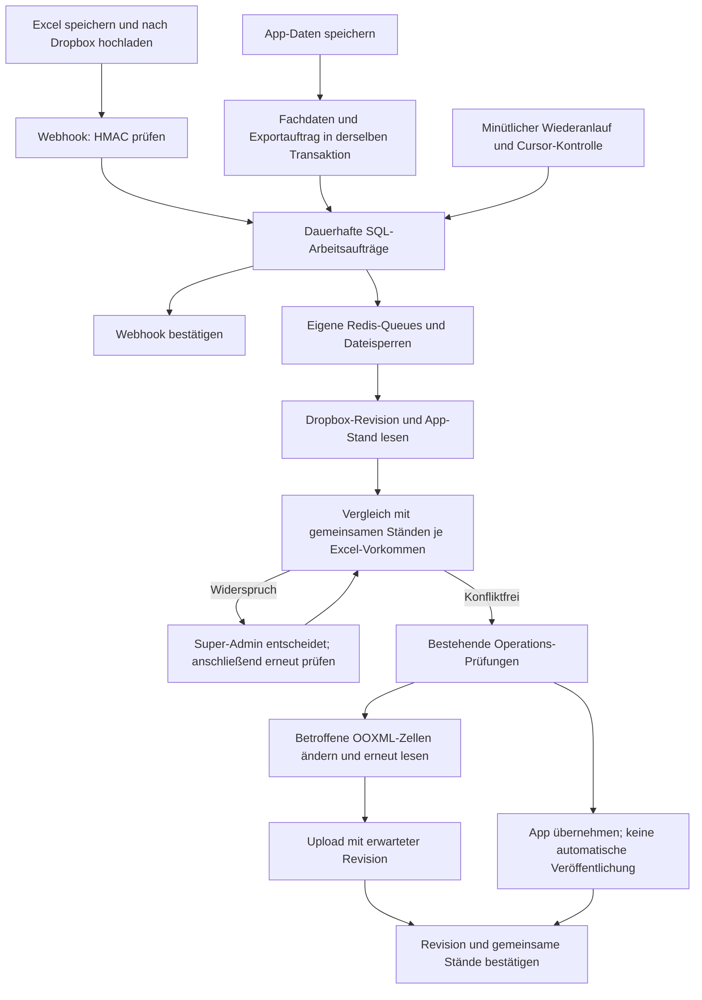
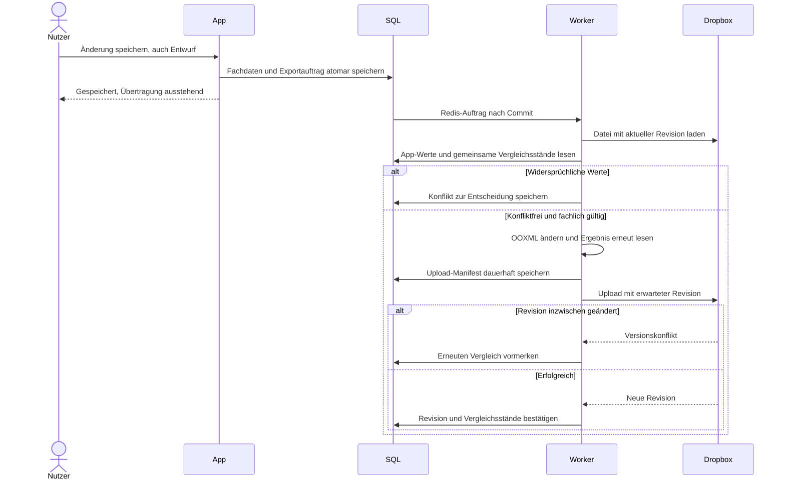

# Dropbox / Excel-Synchronisierung

Die Integration ergänzt **Einstellungen → Super-Admin → Dropbox / Excel-Synchronisierung**. Der erste Zustand ist **Aus**. Nur ein aktiver Super-Admin mit `settings.manage` darf Einrichtung, Vorschau, Zuordnungen und Konfliktentscheidungen ausführen. Die bestehenden App-Queues und Cache-Standards bleiben bestehen.

## Datenfluss



Die Arbeitsaufträge enthalten Modellreferenzen, keine vorab gespeicherten veralteten Fachdaten. Wiederholte Ereignisse erhöhen einen Zähler. Der erste noch offene Auftrag setzt die Bündelungsfrist; weitere Meldungen verschieben sie nicht. Redis erhält verzögerte Jobs direkt nach dem Commit. Bei Redis-Ausfall bleiben die SQL-Aufträge erhalten. Ein abgeschlossener Lauf bestätigt nur den zu Beginn gelesenen Zählerstand.

Große Dateien werden nach dem Lesen in Gruppen von 200 fachlichen Vorkommen verarbeitet. Der Fortschritt ist an die Dateirevision gebunden. Ändert ein Mensch die Datei, wird erneut verglichen. Pro Datei werden Import und Export serialisiert. Ein Upload-Manifest erlaubt Wiederherstellung nach einem erfolgreichen Upload mit verlorener Antwort.



## Einrichtung auf einer Testinstanz

1. App-Code und Frontend-Build ausliefern. Die vorhandenen Operations-Tabellen müssen installiert sein. Das neue Schema ist additiv; bestehende Schichten erhalten `disposition_details`.
2. Die neue Migration nach Prüfung des Zieles ausführen:

   ```sh
   php artisan migrate --path=database/migrations/2026_09_22_100000_create_dropbox_sync_tables.php --force
   ```

3. Redis und den zur Laravel-Konfiguration passenden PHP-Client bereitstellen. Standard ist **phpredis**. Der lokale Windows-Prüfhost hatte weder die PHP-Redis-Erweiterung noch einen laufenden Docker-Redis-Dienst; die tatsächliche Redis-/Worker-Abnahme steht deshalb separat aus.
4. Die eigene Verbindung einstellen, beispielsweise auf einer getrennten Redis-Datenbank:

   ```dotenv
   DROPBOX_REDIS_HOST=127.0.0.1
   DROPBOX_REDIS_PORT=6379
   DROPBOX_REDIS_DB=2
   ```

   Optional: `DROPBOX_REDIS_URL`, `DROPBOX_REDIS_USERNAME`, `DROPBOX_REDIS_PASSWORD`. Keine Zugangsdaten in Dokumente oder Git aufnehmen. `QUEUE_CONNECTION` und der globale Cache-Treiber müssen für Dropbox nicht umgestellt werden. PHP benötigt ZIP, DOM, mbstring und die bereits vorhandenen PhpSpreadsheet-Abhängigkeiten.
5. Drei getrennte, überwachte Worker starten; die tatsächlichen PHP-/Projektpfade des Zielservers einsetzen:

   ```sh
   php -d memory_limit=1536M artisan queue:work dropbox --queue=dropbox-events --sleep=1 --tries=1 --timeout=300 --memory=768
   php -d memory_limit=1536M artisan queue:work dropbox --queue=dropbox-import --sleep=1 --tries=1 --timeout=300 --memory=768
   php -d memory_limit=1536M artisan queue:work dropbox --queue=dropbox-export --sleep=1 --tries=1 --timeout=300 --memory=768
   ```

   Supervisor/systemd: automatisch neu starten, Arbeitsverzeichnis auf die App setzen, denselben Benutzer und dieselbe Umgebung wie Laravel verwenden, mindestens 360 Sekunden zum kontrollierten Beenden gewähren. Queue-`retry_after` ist 360 Sekunden, Sperren gelten 330 Sekunden. Die KW22-Schreibprobe benötigte rund 406 MiB PHP-Spitzenbedarf; Speicherlimit am Ziel mit den aktuellen Dateien verifizieren.
6. Den vorhandenen Laravel-Scheduler jede Minute ausführen. `dropbox:recover` ist im Kernel bereits minütlich eingetragen. Der Befehl sendet Worker-Proben, übernimmt offene SQL-Arbeit und stößt standardmäßig nach 15 Minuten eine Cursor-Kontrolle an.
7. In der Dropbox App Console eine Scoped App mit Zugriff auf die vorhandenen Ordner einrichten. Für vorhandene Firmen-/Teamdateien den entsprechenden vollständigen Dateizugriff wählen. Rechte: `account_info.read`, `files.metadata.read`, `files.content.read`, `files.content.write`.
8. Im Super-Admin-Formular App-Key und App-Secret speichern. Die dort angezeigte OAuth-Adresse exakt als Redirect URI und die Webhook-Adresse als Webhook in der Dropbox App Console eintragen. Die öffentlichen Zieladressen müssen HTTPS verwenden.
9. **Mit Dropbox verbinden** öffnet Dropbox. Die Authorization-Code-Freigabe fordert Offline-Zugriff an. App-Secret, Access- und Refresh-Token werden mit Laravel verschlüsselt gespeichert. `APP_KEY` ist daher Teil der notwendigen Server-Sicherung. Ein Kontowechsel erzeugt eine neue technische Verbindung und startet mit Aus; frühere Jobs können sie nicht übernehmen.
10. Testordner, Namensregel und Kompetenzmatrix auswählen. Weitere ausdrücklich zugeordnete Dateien können mit Dispositions- oder Matrixprofil angegeben werden. Den Root-Namespace übernimmt RailTime aus dem Dropbox-Konto. Geteilte Ordner müssen im freigegebenen Konto erreichbar sein.
11. Eine Wochen- und eine Mitarbeiterblattvorlage hochladen. RailTime erstellt daraus jeweils eine bereinigte Vorlage mit Überschriften, Spaltenbreiten und Zellformaten. Historische Daten, Bilder und Kommentare kommen nicht in neue Vorlagen. Die ausgewählte Mitarbeiterblattvorlage liefert tatsächlich die Formate neu angelegter Blätter.
12. **Verbindung testen**, **Hintergrundverarbeitung testen**, **Vorschau starten**. Personenbezeichnungen unter **Zuordnungen** ausdrücklich als Mitarbeiter mit Konto oder als Dienstleister zuordnen. Keine Konten werden aus Dienstleisterbezeichnungen erstellt.
13. Nach Prüfung der Vorschau **Beidseitig** aktivieren. Aktivierung erfordert passende OAuth-Rechte, geprüfte benötigte Vorlagen und aktuelle Antworten aller drei Worker. Speichern von Einstellungen stoppt den Abgleich und verlangt eine neue Vorschau.

## Betriebsarten

| Modus | Wirkung |
|---|---|
| Aus | Keine automatische Übernahme; explizite Vorschau bleibt möglich. |
| Prüfen | Eingangs- und Ausgangsänderungen berechnen; keine fachliche Übernahme und kein Datei-Upload. Technische Quellen, Zuordnungskandidaten und Prüfhinweise dürfen entstehen. |
| Excel → App | Konfliktfreie Excel-Änderungen importieren. App-Änderungen bleiben erhalten und werden als ausstehende Rückübertragung erkennbar. |
| Beidseitig | Beide Richtungen, neue Zeilen, Wochenmappen und Mitarbeiterblätter gemäß den aktivierten Optionen. |
| Nur App | Erst Abschlussvergleich und verifizierte Archivkopien, dann Token entfernen und automatische Kopplung beenden. |

Bei Abschalten oder Trennen werden Konfigurationsgenerationen gewechselt. Alte Arbeit wird nicht weiter übernommen. Ein bereits gestarteter HTTP-Upload kann noch erfolgreich abschließen; das wird protokolliert. Erledigte fachliche Änderungen werden nicht zurückgerollt.

## Datenvertrag und erkennbare Grenzen

- Disposition: vorhandene B–N-Fachspalten, Einsatzdaten, Planzeit, gemeldetes Istende, Zuordnung, Kunde, Zugreferenz, Bestelldatum, Storno und Bemerkungen. Wiederholte Überschriften und Mitarbeiterblätter werden erkannt. Ein Auftrag ohne Einsatz wird als nicht abbildbar angezeigt; keine Schicht wird erfunden.
- App-Entwürfe werden sofort zur Übertragung vorgemerkt und in Bemerkungen mit `[ENTWURF]` gekennzeichnet. Veröffentlichung erfolgt ausschließlich über den vorhandenen App-Ablauf. Bei Veröffentlichung verschwindet nur diese Kennzeichnung.
- Für importierte Leistungen wird der Status nach dem erfolgreichen Abgleich aus den übernommenen Excel-Angaben abgeleitet: Planzeile → geplant, alle Schichten storniert → storniert, belegter Abschluss aller aktiven Schichten → abgeschlossen. Ein vergangenes Plandatum allein genügt nicht. Ausdrückliche Excel-Entwürfe bleiben angefragt; unveröffentlichte App-Schichten sind davon getrennt. Der vorhandene Statusverlauf dokumentiert die Herkunft und schützt spätere manuelle Entscheidungen. Einzelheiten stehen in `local-excel-import.md` unter „Leistungsstatus aus Excel“.
- Ein Mitarbeiterwechsel aus Excel storniert die bisherige Kopie im alten Mitarbeiterblatt und erzeugt die neue Kopie im richtigen Blatt. Eine Stornierung nur einer Zuordnung darf andere Mitarbeiter derselben Schicht nicht stornieren.
- Kontakte: Mitarbeiter- und Dienstleisterübersicht der Matrix sowie vorhandene externe Kontaktlisten in Wochenmappen. Kontakt-E-Mail bleibt von der Login-Adresse getrennt. Passwörter, App-Rollen und Kontofreigaben werden nicht importiert. Ein vollständiges Kundenstammdatenblatt liegt nicht vor; aktuell ist insbesondere die belegte Kundenbezeichnung abbildbar.
- Kompetenzen: Kundenfreigaben/-sperren, Unterlagenangaben, Einweisungen, Ortskunde sowie Verfügbarkeitsnotizen mit Zellfarbe. Gemeldete Angaben sind eigenständige Fachdaten. Eine grüne Zelle erzeugt keinen freigegebenen Nachweis. Rote Kundensperren und gemeldete abgelaufene Unterlagenfristen fließen in die Einsatzprüfung ein.
- In der Bearbeitung einer Kompetenzangabe kann ein bestehender App-Nachweistyp ausdrücklich mit Status, Gültig-ab oder Gültig-bis verknüpft werden. App-Nachweisänderungen werden dann zurückgeschrieben. Excel kann den geprüften Nachweis nicht genehmigen oder umschreiben. Nicht zuordenbare Nachweise bleiben als Hinweis sichtbar.
- Freitext zur Verfügbarkeit bleibt Freitext und erzeugt keine erfundene genehmigte Abwesenheit. Bildinhalte und nicht vorhandene Kundenkontakte sind keine automatisch importierbaren Tabellenfelder. Zusätzliche Matrixangaben lassen sich nur in vorhandene fachlich passende Spalten schreiben; fehlende Spalten führen zu einem konkreten Prüfhinweis.
- App-Zeitmeldungen liefern das Istende für die Rückübertragung. Eine spätere Excel-Abweichung wird als ungeprüfte Meldung getrennt gehalten; keine automatische Zeitfreigabe, Abrechnung oder Änderung des genehmigten Nachweises.
- Dateiname und tatsächliche ISO-Einsatzwochen bestimmen die Zuordnung. Dateierkennung wird als **erstmals erkannt** beschriftet. Die beiden Beispieldateien tragen intern noch ein Erstellungsdatum von 2015. Mehrere mögliche Zielmappen führen zur Zielauswahl; `aktuell` und Änderungszeit gewinnen nicht automatisch.
- Die Standardregel erzeugt z. B. `Aufträge KW 40 2026.xlsx`. Eigene Regeln benötigen für automatische Neuanlage `{KW}` und `{YYYY}`. Konfliktkopien, temporäre Dateien und Sicherungen werden nicht automatisch als neue Wochenquelle verwendet.
- Physisch fehlende Zeilen/Dateien lösen keine fachliche Löschung aus. Fehlende Zeilen können ausdrücklich aus der App wieder angelegt werden. Unbekannte oder mehrdeutige Zeilen müssen zugeordnet oder in Excel korrigiert werden.
- Hauptübersicht und Mitarbeiterblätter haben getrennte Vergleichsstände. Unveränderte Kopien können neuere Werte nicht zurücksetzen. Gleiche Feldänderungen werden bestätigt, unterschiedliche Felder zusammengeführt, widersprüchliche Werte zurückgehalten. Eine Entscheidung gilt nur für die erneut geprüften Werte und Versionen.
- Dateiübergreifende Änderungen haben keine gemeinsame Dropbox-Transaktion. Noch offene Aufträge bzw. Quellen zeigen den Teilfortschritt. Die Integration verwendet keine technischen Excel-ID-Spalten und keine versteckten Synchronisierungstabellen.

## Excel-Erhalt und lokale Prüfung

PhpSpreadsheet liest und prüft die Daten. Bestehende Mappen werden anschließend gezielt als OOXML bearbeitet. Unbetroffene Paketbestandteile werden bytegleich übernommen und vor Rückgabe geprüft. Unveränderte Formelzellen werden nicht neu geschrieben; ein benötigter Schreibzugriff auf eine Formelzelle wird zur Prüfung zurückgehalten. Vor jedem Upload liest der Writer das Ergebnis erneut und vergleicht die Zielwerte.

```sh
php -d memory_limit=1536M artisan dropbox:inspect "/path/Aufträge KW 38 aktuell.xlsx" --roundtrip
php -d memory_limit=1536M artisan dropbox:inspect "/path/Kompetenzmatrix Mitarbeiter 07.09.2026.xlsx" --profile=matrix --roundtrip
php artisan test --filter=DropboxSyncTest
```

`dropbox:inspect` verändert die Originaldatei nicht. Die gezielten Proben prüfen mehrere Fachprofile einschließlich Hauptübersicht und Mitarbeiterblatt. Dies ist kein Nachweis dafür, dass Desktop-Excel und Browser-Excel keine Reparaturmeldung zeigen; diese Prüfung gehört zur realen Abnahme.

## Abschluss „Nur App“

Excel-Bearbeitungen speichern und Dropbox-Uploads abwarten. Im Formular den Abschluss wählen und bestätigen, dass währenddessen niemand weiter in Excel schreibt. Offene Konflikte und Arbeitsaufträge müssen geklärt sein. Daten, die die bereitgestellten Tabellen nicht abbilden können, können ausdrücklich als derzeit nur in App vorhanden vermerkt werden.

RailTime führt einen vollständigen Abgleich durch, legt revisionsbezogene Archivkopien in einem eigenen `RailTime-Archiv-…`-Ordner an und kontrolliert die Quellen vor dem Trennen erneut. Bei einer neuen Revision bleibt die Verbindung bestehen und der Abgleich wird nachgeholt. Die Originaldateien werden dabei nicht gelöscht. Erst danach wechselt der Modus zu Nur App.

## Reale Abnahme: noch auszuführen

Die Implementierung und simulierten API-Tests allein sind kein Betriebsnachweis. Auf der vereinbarten Testinstanz prüfen:

- Desktop-Excel und Browser-Excel speichern → Webhook → App, einschließlich Kontakte, Kompetenzen und Entwürfe.
- App speichern → Hauptübersicht und Mitarbeiterblatt, neue Person, neue Woche, Jahreswechsel und KW53.
- Gleichzeitiges Ändern desselben Felds; Entscheidung nach erneutem Zwischenstand muss zurückgewiesen werden.
- Upload-Timeout, Redis-/Worker-Neustart, OAuth-Erneuerung, widerrufene Freigabe, Rate-Limit und ungültiger Cursor.
- Aus, Trennen und Kontowechsel bei vorgemerkter und bereits laufender Arbeit; keine Übernahme alter Jobs.
- Alle drei Prüfkopien mit Desktop- und Browser-Excel öffnen, Kommentare, Formeln, Layout und Druck prüfen.
- HTTPS-Challenge, signierter Webhook-Eingang, alle drei Worker und minütlicher Scheduler am tatsächlichen Zielserver.
- Archivierung mit anschließender Trennung und erhaltenem App-Datenbestand.

Primäre technische Grundlagen: [Dropbox Webhooks](https://docs.dropboxapi.com/dropbox-api/docs/webhooks), [Dropbox OAuth](https://docs.dropboxapi.com/dropbox-api/docs/oauth), [Dropbox Schreibvertrag](https://github.com/dropbox/dropbox-api-spec/blob/main/files.stone), [Laravel Queues](https://laravel.com/docs/12.x/queues).
