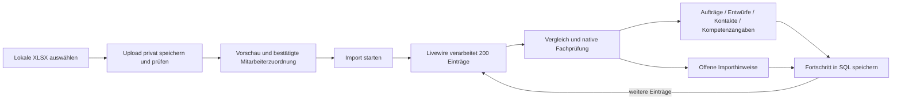

# Lokaler Excel-Import

Unter **Einstellungen → Super-Admin → Lokaler Excel-Import** lassen sich XLSX-Dateien einzeln hochladen, prüfen und in die normale App-Datenbank übernehmen. Ein Ordnerdienst, Dropbox-Konto, Redis oder Queue-Worker ist dafür nicht erforderlich. Die Funktion schreibt weder in die Originaldateien noch zurück zu Dropbox. Eine Rücksetzfunktion ist bewusst nicht enthalten.

## Bedienung

1. Ein aktives Regelprofil in der Schichtplanung einrichten. Ohne dieses Profil werden Mitarbeiter-Einsätze durch die vorhandene Einsatzprüfung zurückgehalten; Dateivorschau und Mitarbeiterzuordnung sind bereits möglich.
2. Zuerst die Kompetenzmatrix auswählen und **Datei prüfen**. Der Dateityp wird am Namen erkannt und kann manuell ausgewählt werden. Vorschau enthält Kontakte, Kompetenzangaben, Planungsvorkommen, Einsatzwochen und Auffälligkeiten.
3. Personen ausdrücklich einem bestehenden aktiven Mitarbeiterkonto zuordnen. Ein eindeutiger Namensvorschlag ist noch keine bestätigte Zuordnung. Dienstleister erhalten keine Benutzerkonten.
4. In `local` und `testing` kann für eine ungeklärte Person **Neues lokales Testkonto** gewählt werden. Passwort mit mindestens zwölf Zeichen selbst festlegen, dann Zuordnung speichern. Die angezeigte Adresse `excel-test-<id>@railtime.invalid` dient zusammen mit diesem Passwort zum Testlogin. Es wird keine Einladung verschickt; vorhandene Passwörter werden nicht geändert. In anderen Umgebungen ist diese Option serverseitig gesperrt.
5. **In die App importieren** starten und die Seite offen lassen. Je Anfrage werden bis zu 200 Excel-Vorkommen verarbeitet. Pausieren und Fortsetzen sind möglich. Nach einem geschlossenen Browser die laufende Datei erneut unter „Bisherige Importdateien“ auswählen.
6. Anschließend eine Wochenmappe ebenso einlesen. Für den ersten Test eignet sich die bereitgestellte KW38-Datei; KW22 enthält viele historische Einsätze und verschiedene Wochen.
7. Ergebnis und Hinweise kontrollieren. Die Schichten sind normale App-Datensätze, bleiben aber Entwürfe. Für die Mitarbeiteransicht den gewünschten Plan über den vorhandenen Veröffentlichungsablauf freigeben und die passende Kalenderwoche öffnen. Importierte Istzeiten werden nicht automatisch genehmigt.

Wenn eine andere Datei geöffnet wird, arbeitet die vorherige erst nach ihrer erneuten Auswahl weiter. Solange ein Import als laufend gespeichert ist, muss er beendet oder pausiert werden, bevor eine weitere Datei geprüft oder eine Zuordnung geändert werden kann.

## Daten und Grenzen

- Dieselbe Originaldatei unter demselben Namen erneut auswählen, um sie abzugleichen. Der Quellenbezug besteht aus normalisiertem Originalnamen und Dateityp. Umbenannte Dateien gelten als andere Quellen; das ist keine Ordnerüberwachung mit Dateisystem-IDs.
- Wiederholungen verwenden gespeicherte Zuordnungen und Vergleichsstände. Widersprüchliche App-/Excel-Änderungen bleiben als Hinweise stehen und überschreiben die App nicht. Werte in App oder Originaldatei angleichen, anschließend erneut prüfen und abgleichen.
- Mehrfach vorkommende Zeilen in Hauptübersicht und Mitarbeiterblättern sind nicht automatisch zusätzliche Schichten. Mehrdeutige Vorkommen werden zur Prüfung zurückgehalten.
- Namen allein lösen keine automatische Kontozusammenführung aus. Nicht zugeordnete Personen und fachlich ungültige Einsätze bleiben sichtbar zurückgehalten.
- Native Regeln für Überschneidungen, Pausen, Ruhezeiten und gemeldete Sperren gelten unverändert. Fehlende Pausen werden nicht erfunden. Gemeldete Kompetenzangaben sind keine freigegebenen Nachweise.
- Dateien dürfen maximal 12 MB groß sein; PHP/Webserver müssen entsprechende Upload-Grenzen erlauben. Größere historische Mappen benötigen beim Einlesen mehrere hundert MiB RAM; der Import hebt nur für seine Leseanfrage das PHP-Limit auf 1024 MB an, sofern es niedriger ist.
- Hochgeladene Dateien und geprüfte Parserdaten liegen privat unter `storage/app/private/local-excel`. Ein Datenbankreset entfernt diese Dateien nicht. Es gibt keine automatische Löschung der Importhistorie oder Originaldateien.

## Technischer Ablauf

### Leistungsstatus aus Excel

Der Import unterscheidet den Status der Leistung vom Veröffentlichungsstatus ihrer Schichten. Eine Dispositionszeile mit gültigen Planzeiten ohne `[ENTWURF]` ergibt eine **geplante Leistung**, während die importierte Schicht unveröffentlicht bleibt. Ein vergangenes Plandatum allein belegt keinen Abschluss.

- Sind alle Schichten einer importierten Leistung storniert, wird auch die Leistung **storniert**. Die Stornierung einer einzelnen Mitarbeiterzuordnung reicht dafür nicht.
- Ein übernommenes, bereits vergangenes Istende oder ein ausdrücklicher Abschlussvermerk (`erledigt`, `abgeschlossen`, `durchgeführt`, optional mit `Status:`) in Bemerkungen/Infos belegt den Abschluss. Ein solcher Vermerk muss das vollständige Feld bilden; verneinte oder beiläufige Texte gelten nicht als Abschluss. Bei mehreren aktiven Schichten muss der Abschluss für alle belegt sein.
- Ein ausdrücklich in Excel markierter Entwurf bleibt **angefragt**. Die bloße technische Anlage als unveröffentlichte Schicht bedeutet dagegen keinen Excel-Entwurf.
- Statuswechsel werden mit Herkunft „Excel-Import“ im vorhandenen Verlauf protokolliert. Manuelle Statusentscheidungen und Endzustände werden bei Wiederholungen geschützt. Unveränderte Kopien erzeugen keine zusätzlichen Statuswechsel.
- Daraus entstehen weder Veröffentlichungen, Mitarbeiterbestätigungen, Zeitfreigaben noch Abrechnungen.

Am 23.09.2026 wurde der lokale Altbestand korrigiert: zuvor 1403 Leistungen pauschal **angefragt**, danach 1399 **storniert** und 4 **geplant**. Bei den vier nicht stornierten Leistungen fehlt der Abschlussbeleg. Die Korrektur änderte keine Schichten oder Zuordnungen und versandte keine E-Mails. Zurückgehaltene Importzeilen benötigen weiterhin das Regelprofil bzw. geklärte Zuordnungen.

`LocalExcelImporter` verwendet `WorkbookReader`, `FileSynchronizer` und `DomainAdapter` mit einem ausschließlich lokalen Datei-Client und eigener Zugriffsprüfung. Ein Dateicache-Lock serialisiert lokale Importaktionen. SQL speichert Quellen, Vergleichsstände, Kontozuordnungen und Fortschritt. Die vorbereitete Parserausgabe und die Datei werden vor jedem Abschnitt über SHA-256 geprüft.

Der lokale Verbindungskontext hat `settings.source=local` und keine OAuth-Tokens. Remote-Einstellungen, OAuth und App-Änderungserfassung wählen ausschließlich Remote-Verbindungen. Lokale Importe erzeugen keine Dropbox-Arbeitsaufträge; der normale Remote-SyncGuard weist lokale Quellen zurück.

## Installation und lokaler Nachweis vom 23.09.2026

Bei konsistenter Migrationshistorie werden die vorhandenen Operations-/Dropbox-Migrationen und `2026_09_23_090000_create_local_excel_imports_table` regulär mit `php artisan migrate` ausgeführt. Die Operations-Migration wurde für den beobachteten MariaDB-Timestampfehler korrigiert und kann nach einem abgebrochenen Tabellenaufbau fortgesetzt werden.

Auf diesem Gerät wurden die erforderlichen fehlenden Tabellen gezielt ergänzt, ohne bestehende Daten zurückzusetzen. Die ältere Basistabellen-Historie war bereits unvollständig; sie wurde nicht künstlich als migriert markiert. Die reguläre Settings-Komponente rendert auf der lokalen MySQL-Datenbank mit beiden Excel-Bereichen erfolgreich.

Die drei bereitgestellten Originaldateien wurden zunächst als Vorschau registriert und anschließend auf ausdrücklichen Nutzerauftrag lokal verarbeitet. Für die 43 eindeutig erkannten Personen der Mitarbeiterübersicht wurden lokale Testkonten mit synthetischen Login-Adressen angelegt, ohne E-Mail- oder Benachrichtigungsversand. Dienstleister bleiben eigene Zuordnungen; unklare historische Personenbezeichnungen werden nicht automatisch zusammengeführt.

Das lokale Regelprofil fehlt weiterhin. Dadurch bleiben Mitarbeiterzuweisungen zurückgehalten. Übernommen wurden 1403 Schichten, davon 1399 laut Excel storniert und 4 Entwürfe; keiner dieser Dienste wurde veröffentlicht. Dazu kommen 55 Kunden und 7913 gemeldete Kompetenzangaben. Weitere Importhinweise betreffen unvollständige Zeiten, widersprüchliche Kopien und gemeldete Sperren. Die ursprünglichen XLSX-Dateien sind unverändert. Der konkrete Lauf ist im Koordinationsbericht `2026-09-23-local-import-run.md` dokumentiert.

Bei Matrixblättern werden Gruppenüberschriften nur innerhalb ihrer tatsächlichen verbundenen Kopfzellen fortgeführt. Rechts anschließende unbeschriftete Formatierungsspalten erzeugen keine Kompetenzangaben. Die lokale Verarbeitung speichert einen Abschnitt und dessen Fortschritt in derselben Datenbanktransaktion; ein abgebrochener Abschnitt kann erneut ausgeführt werden.

Für `npm run dev` sind Laravel-Laufzeitverzeichnisse vom Vite-Watcher ausgeschlossen. Tailwind liest die eigentlichen Templates und Komponenten, keine kompilierten Views oder Laufzeitcachedateien. Damit lösen Importfortschritte und normale Seitenaufrufe keine Reload-Schleife aus.
